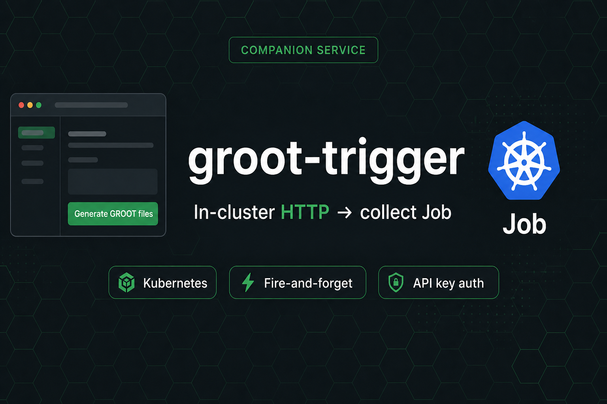

# groot-trigger

<a id="readme-top"></a>

**⚡** _In-cluster HTTP API that creates a Kubernetes Job running [`groot`](https://github.com/hrodrig/groot) collect_

[](https://github.com/hrodrig/groot-trigger/releases)
[](https://github.com/hrodrig/groot-trigger/releases)
[](https://go.dev/)
[](./LICENSE)
[](https://github.com/hrodrig/groot-trigger/actions/workflows/ci.yml)
[](https://gghstats.hermesrodriguez.com/hrodrig/groot-trigger)

**Repo:** [github.com/hrodrig/groot-trigger](https://github.com/hrodrig/groot-trigger) · **Releases:** [GitHub Releases](https://github.com/hrodrig/groot-trigger/releases) · **Spec:** [docs/SPECIFICATIONS.md](docs/SPECIFICATIONS.md) · **Deploy:** [deploy/k8s](deploy/k8s/README.md) · **Scheduled collect:** [groot-selfhosted](https://github.com/hrodrig/groot-selfhosted) · **Changelog:** [CHANGELOG.md](CHANGELOG.md) · **Roadmap:** [ROADMAP.md](ROADMAP.md)

<p align="center">
  
</p>

**The problem:** Operators want a **“Generate GROOT files”** control (browser or HTTP client) that starts an in-cluster **`groot collect`**, optionally uploads the archive to object storage, and returns quickly — without blocking the client for the full collect window. The **groot** product is a **one-shot CLI** by design (no HTTP server, no long-lived collector daemon). Putting an API inside **groot** would break that philosophy. A CronJob covers *schedule*; it does not cover *button / API on demand*.

**How groot-trigger solves it:** An idle **Deployment** in the cluster exposes `GET/POST /v1/collect`. The GET serves a minimal **vanilla** HTML page (API key + **Generate GROOT files**). The POST authenticates, rate-limits, enforces single-flight (`409` if a collect Job is already running), and creates an ephemeral Kubernetes **Job** that runs `ghcr.io/hrodrig/groot` with the operator’s ConfigMap / Secrets. The trigger stays fire-and-forget (`202` + `run_id`); completion shows up via groot notify and/or object storage — not by proxying the archive through this service.

> **Runtime target is Kubernetes.** Ship and run the published image (`ghcr.io/hrodrig/groot-trigger`) with the flat manifests under [deploy/k8s](deploy/k8s/README.md). This companion does **not** replace the CLI; scheduled / bastion collect stays in **[groot-selfhosted](https://github.com/hrodrig/groot-selfhosted)**.

**Related tools (same maintainer):**
- **[pgwd](https://github.com/hrodrig/pgwd)** — PostgreSQL connection watchdog ([live traffic](https://gghstats.hermesrodriguez.com/hrodrig/pgwd); deploy: [pgwd-selfhosted](https://github.com/hrodrig/pgwd-selfhosted))
- **[gghstats](https://github.com/hrodrig/gghstats)** — GitHub repo traffic beyond 14 days ([live demo](https://gghstats.hermesrodriguez.com); deploy: [gghstats-selfhosted](https://github.com/hrodrig/gghstats-selfhosted))
- **[kzero](https://github.com/hrodrig/kzero)** — bastion-first declarative workload reset ([live traffic](https://gghstats.hermesrodriguez.com/hrodrig/kzero); deploy: [kzero-selfhosted](https://github.com/hrodrig/kzero-selfhosted))
- **[groot](https://github.com/hrodrig/groot)** — Kubernetes diagnostics archive ([live traffic](https://gghstats.hermesrodriguez.com/hrodrig/groot); deploy: [groot-selfhosted](https://github.com/hrodrig/groot-selfhosted))

## Table of contents

- [HTTP API](#http-api)
- [Deploy on Kubernetes](#deploy-on-kubernetes)
- [HTTP API usage](#http-api-usage)
- [Build (maintainers)](#build-maintainers)
- [Family roles](#family-roles)
- [License](#license)

[↑ Back to top](#readme-top)

## HTTP API

| Endpoint | Behavior |
|----------|----------|
| `GET /healthz` | Liveness |
| `GET /readyz` | Readiness (in-cluster Kubernetes client available) |
| `GET /v1/collect` | Vanilla HTML: API key + **Generate GROOT files** |
| `POST /v1/collect` | Start Job → `202` + `run_id` (JSON or HTML); `401` / `409` / `429` |

Auth (POST / form): `X-API-Key`, `Authorization: Bearer …`, or form field `api_key`. Fail closed if `GROOT_TRIGGER_API_KEY` is unset.

Behavior contract: **[docs/SPECIFICATIONS.md](docs/SPECIFICATIONS.md)**.

[↑ Back to top](#readme-top)

## Deploy on Kubernetes

Primary path: apply the flat manifests (Deployment, Service, RBAC, sample ConfigMap). Create the API-key Secret first — see [deploy/k8s/README.md](deploy/k8s/README.md).

```bash
kubectl -n groot create secret generic groot-trigger-api \
  --from-literal=GROOT_TRIGGER_API_KEY='replace-me'

kubectl apply -f deploy/k8s/manifests.yaml
```

Image (after first release): `ghcr.io/hrodrig/groot-trigger:v0.1.0` (GoReleaser; **`v`-prefixed** tags only).

Reach the UI/API via ClusterIP Service, Ingress, or a temporary port-forward from a machine that can reach the cluster API/network:

```bash
kubectl -n groot port-forward svc/groot-trigger 8080:8080
# then open http://127.0.0.1:8080/v1/collect
```

Optional object-storage upload for the collect Job: enable `upload` in the ConfigMap and set `GROOT_ENVFROM_SECRET` on the Deployment (same Secret pattern as **groot-selfhosted**).

[↑ Back to top](#readme-top)

## HTTP API usage

After the Service is reachable (Ingress, or temporary `kubectl port-forward` as above):

```bash
# HTML form (browser): GET /v1/collect

# JSON start (replace host with your Ingress / port-forward URL)
curl -sS -X POST \
  -H "X-API-Key: $GROOT_TRIGGER_API_KEY" \
  -H "Accept: application/json" \
  http://127.0.0.1:8080/v1/collect
# → 202 {"run_id":"…","job":"groot-collect-…"}
```

Single-flight: a second POST while a collect Job is Pending/Running returns **`409`**. Rate limits return **`429`**.

[↑ Back to top](#readme-top)

## Build (maintainers)

For contributors building the binary/image before a release:

```bash
make ci              # fmt-check + lint + gocyclo + test
make cover           # coverage gate COVER_MIN=80
make release-check   # full pre-tag gate (goreleaser check skips until origin exists)
make docker-build-amd64
```

BSD ports / man: [contrib/README.md](contrib/README.md).

[↑ Back to top](#readme-top)

## Family roles

| Repo | Role |
|------|------|
| **[groot](https://github.com/hrodrig/groot)** | CLI collector, SPEC, `ghcr.io/hrodrig/groot` |
| **[groot-selfhosted](https://github.com/hrodrig/groot-selfhosted)** | CronJob / Helm / bastion / docker run |
| **groot-trigger** (this repo) | In-cluster HTTP → on-demand collect Job |

English only for all project artifacts.

[↑ Back to top](#readme-top)

## License

[MIT](./LICENSE)

[↑ Back to top](#readme-top)
